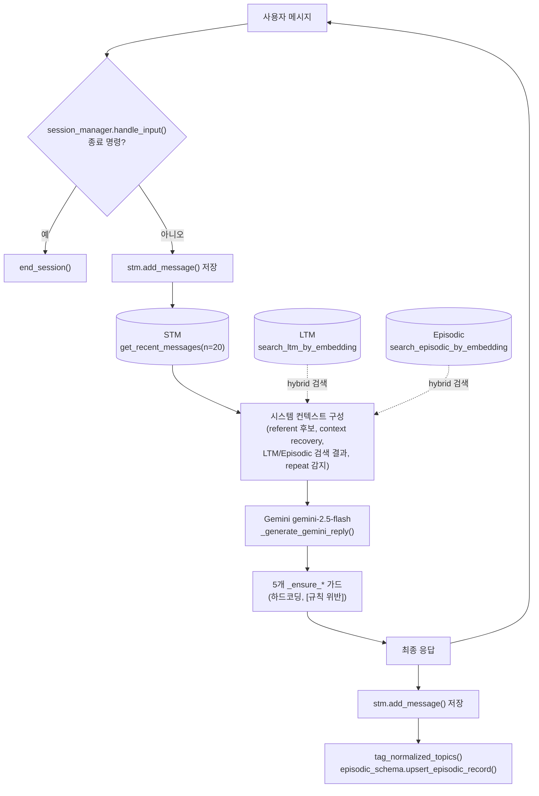
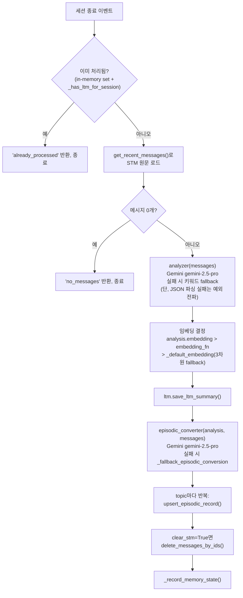

# 아키텍처

> 진행 중인 정리 작업 기준. `[정리 대상]` 표시는 GDG 워크숍 데모 재현을 위해 만들어졌던 코드로, 단계적으로 제거될 예정이다. 자세한 배경은 `[[project-memory-augmented-chatbot-refactor]]` 메모리 참고. `[규칙 위반]` 표시는 CLAUDE.md CRITICAL 규칙을 실제로 위반하고 있는 현재 코드 상태다 — 상세는 `docs/ADR.md`의 "발견된 규칙 위반" 참고.

## 디렉토리 구조
```
chatbot.py                    # Chatbot 클래스: 대화 진입점 + 메모리 주입 루프
episodic_schema.py             # Episodic 저장소 스키마 (SQLite + Chroma)
memory/
├── __init__.py                  # [불일치] 패키지 공개 API가 demo_conversion.py 함수만 export함 (아래 "알려진 불일치" 참고)
├── stm.py                     # STM 저장소 (세션 원문 메시지)
├── ltm.py                     # LTM 저장소 (세션 요약, SQLite + Chroma) — 임베딩은 생성하지 않고 저장만 함
├── retrieval.py                # LTM/Episodic 검색 입력 구성과 hybrid 점수 계산 (Chroma/임베딩 자체는 다루지 않음)
├── session_manager.py           # 세션 시작/종료 이벤트 처리 (SessionEndCriteria 기반 자동 종료 기능 포함, chatbot.py에서는 미사용)
├── consolidation.py              # 세션 종료 시 STM -> LTM/Episodic 전이 (실제 사용 경로)
├── tagger.py                      # LLM 기반 topic tagging (gemini-2.5-flash)
├── demo_fixture.py                 # [정리 대상] GDG 데모 학습자 픽스처
└── demo_conversion.py                # [정리 대상 일부] 유휴/일 단위 배치 승격 API + 데모 변환 도구
data/
├── chatbot.db                        # SQLite (STM/LTM/Episodic 테이블), gitignore 대상
├── chroma/                            # Chroma 벡터 저장소, gitignore 대상
└── demo_memory_*.json                  # [정리 대상] 데모 픽스처 원본 JSON
scripts/                                # Harness 메타 도구 (챗봇 로직과 무관, 별도 관심사)
notebooks/                              # 원본 GDG 워크숍 핸즈온 노트북
```

## 패턴
- 클래스는 얇게: `Chatbot`은 진입점 역할만 하고, 실제 로직은 `memory/*.py`와 `episodic_schema.py`의 모듈 함수들에 위임한다. **단, `chatbot.py`에는 이 원칙을 어기는 예외가 하나 있다** — `learner_persona` 테이블(`DDL_LEARNER_PERSONA`, `init_demo_learner_persona`, `load_demo_learner_persona`, `chatbot.py:262-304`)은 `memory/*.py`를 거치지 않고 `chatbot.py`가 직접 `conn.executescript`/`conn.execute`로 SQL을 짠다. `[규칙 위반]`
- 저장소는 이중화: 구조화된 필드(요약, 태그, 이력)는 SQLite에, 검색용 벡터는 Chroma에 저장한다.
- Best-effort fallback: LLM 호출(topic tagging, 요약, 임베딩 등)이 실패하거나 없을 때는 예외를 던지는 대신 deterministic fallback으로 대체해 대화 흐름이 끊기지 않게 한다 — 단, 이 원칙이 지켜지지 않는 지점이 있다(아래 "에러 처리 전략" 표 참고).
- 커밋 전략: 각 쓰기 함수가 완료 즉시 개별 `conn.commit()`을 호출한다(단일 원자적 트랜잭션으로 묶이지 않음). 크래시 안전성은 확보되지만(부분 쓰기가 남지 않음), 여러 단계로 구성된 승격 파이프라인(LTM 저장 → Episodic upsert)에서는 중간 실패 시 정합성이 깨질 수 있다(아래 "알려진 정합성 리스크" 참고).
- 임베딩 fallback은 현재 서로 다른 곳에서 호환되지 않는 방식으로 존재하는 문제가 있어 별도 정리가 필요하다(아래 "임베딩 스킴" 참고).

## 모듈별 공개 API

### `memory/stm.py`
| 함수 | 역할 |
|---|---|
| `open_db(db_path) -> Connection` | WAL 모드로 SQLite 연결, `init_stm` 자동 호출 |
| `add_message(conn, session_id, role, content, turn_index, timestamp=None) -> str` | 메시지 저장(UUID 발급, 즉시 commit). `role`은 `user`/`assistant`/`system`만 허용, 그 외는 `ValueError` |
| `get_recent_messages(conn, session_id, n=20) -> list[dict]` | 최근 n개(turn_index 기준), 시간순 정렬해 반환 |
| `get_all_messages(conn, session_id) -> list[dict]` | 세션 전체 메시지 (consolidation용) |
| `get_next_turn_index(conn, session_id) -> int` | 다음 turn_index 계산 |
| `delete_session_messages` / `delete_messages_by_ids` | 승격 후 STM 정리용 삭제 |

### `memory/ltm.py`
| 함수 | 역할 |
|---|---|
| `save_ltm_summary(LTMSummaryInput, ...) -> ltm_id` | SQLite insert + (embedding이 있을 때만) Chroma add. **임베딩을 직접 생성하지 않음** — 호출자가 만든 벡터를 그대로 저장 |
| `search_ltm_by_embedding(query_embedding, n_results=5, keyword_tokens=None) -> list[dict]` | Chroma cosine 검색 → SQLite hydrate → 키워드 있으면 hybrid 재정렬 |
| `get_ltm_by_session` / `get_ltm_by_id` / `get_all_ltm` | 조회 |
| `init_ltm(conn=None, ensure_vector_collection=True)` | SQLite 테이블 + Chroma 컬렉션 초기화 |

### `episodic_schema.py`
| 함수 | 역할 |
|---|---|
| `upsert_episodic_record(...)` | topic 정규화 → 정확 매치 또는 `find_repeated_episodic_record`(유사도 기반)로 기존 레코드 탐색 → 있으면 리스트 필드 병합(`_merge_ordered`, dedup) + `occurrence_count += 1`, 없으면 INSERT. `topic_embedding`이 있으면 Chroma에도 upsert |
| `find_repeated_episodic_record(...)` | `SequenceMatcher` + 토큰 자카드 유사도로 topic/topic_tags/questions 비교, 기본 임계값 **0.86**(`DEFAULT_REPEAT_DETECTION_THRESHOLD`) 이상이면 동일 주제로 간주 |
| `search_episodic_by_embedding(...)` | Chroma 벡터 검색 → SQLite hydrate → 키워드 hybrid 재정렬 |
| `get_episodic_by_topic` / `get_episodic_by_id` / `list_all_episodic` | 조회. **삭제 함수는 없음** |
| `normalize_topic_tag(topic, category=None) -> str` | `category:topic-slug` 형식 강제. 빈/불명확 토픽 → `general:uncategorized`, 알 수 없는 category → `general`로 강등 |

이 파일 자체는 임베딩을 생성하지 않고, 호출자가 넘긴 벡터를 그대로 저장/검색에 쓴다 — 차원 검증이나 정규화는 없다.

### `memory/consolidation.py`
`consolidate_session(conn, session_id, ...)`이 `SessionMemoryConsolidator.consolidate()`의 래퍼로, 실제 사용 경로다. 세션당 최대 **Gemini 호출 2회**(요약 1회 + Episodic 변환 1회), 둘 다 실패해도 deterministic fallback으로 완주 가능.

### `memory/tagger.py`
| 함수 | 역할 |
|---|---|
| `tag_topics(...)` | 레거시. 단순 문자열 리스트 토픽 반환 (`gemini-2.5-flash`) |
| `tag_normalized_topics(...)` | 구조화 JSON(`{topic, category, confidence, source_turn_indices}`) 요청, 스키마 검증, confidence < 0.6(`min_confidence` 기본값) 제외, `max_topics`(기본 5, 1~10 clamp)까지만 채택 |

### `memory/retrieval.py`
Chroma/임베딩을 직접 다루지 않는 순수 유틸리티. `extract_keyword_tokens`(소문자화 → 정규식 토큰화 → 불용어 제거 → dedup), `calculate_hybrid_score`(아래 "검색/hybrid score" 참고), `build_ltm_retrieval_input`/`build_episodic_retrieval_input`(dataclass 검증 — 빈 질의/빈 키워드는 `RetrievalInputValidationError`), `merge_memory_search_results`(여러 소스 결과를 점수순 병합 + top-k 자르기).

### `memory/session_manager.py`
| 함수 | 역할 |
|---|---|
| `SessionManager.start_session(session_id=None) -> str` | 이미 활성 세션이 있으면 `RuntimeError` |
| `SessionManager.end_session(...) -> Optional[str]` | 세션이 없으면 `None` 반환(안전 no-op), `on_session_end`/`on_session_end_event` 콜백 순차 호출 |
| `SessionManager.handle_input(text, turn_count=None, inactive_seconds=None) -> bool` | 종료 판정(`should_end_session`) 후 자동 종료 |
| `should_end_session(...)` | 우선순위: 명시적 exit 명령 > `max_turns` 도달 > `inactivity_timeout_seconds` 초과. **`chatbot.py`는 `SessionEndCriteria`를 넘기지 않아 실제로는 명시적 exit 명령만 작동한다** |

## 설정 (Configuration)
환경변수/설정 파일은 아래 항목뿐이며, 전용 config 모듈 없이 `chatbot.py` 상수와 함수로 흩어져 있다.

- **`GEMINI_API_KEY` 해석 순서** (`_read_gemini_api_key`, `chatbot.py:944-968`): ① 환경변수 `GEMINI_API_KEY` → ② `~/.env`(`GEMINI_ENV_PATH = Path.home() / ".env"`, `chatbot.py:176`) → ③ 현재 작업 디렉터리의 `./.env`. 셋 다 없으면 `genai.Client(api_key=None)`로 클라이언트가 만들어지고, **첫 Gemini 호출이 일어나야 실패가 드러난다**(사전 검증 없음, PRD "에러/엣지 케이스" 참고).
- **모델**: 응답 생성 `gemini-2.5-flash`(`DEFAULT_CHATBOT_RESPONSE_MODEL`, `max_output_tokens=1024`, `chatbot.py:1021-1039` — temperature 등은 API 기본값을 그대로 씀), topic tagging `gemini-2.5-flash`(`tagger.py`), 세션 요약/Episodic 변환 `gemini-2.5-pro`(`memory/consolidation.py`).
- **타임아웃/재시도 없음**: 세 Gemini 호출 지점(응답 생성, topic tagging, consolidation) 어디에도 요청 타임아웃이나 재시도/backoff 로직이 없다 — 네트워크 지연이나 429(rate limit)가 나면 그대로 예외가 전파되거나(응답 생성, 요약) 무기한 대기한다.
- **DB/Chroma 경로**: `DATA_DIR = <repo>/data`, `resolve_default_db_path`/`resolve_default_chroma_path`(`chatbot.py:77-101`)가 `DEMO_DB_PATH`(`data/demo.sqlite3`) 존재 여부로 데모 DB 또는 `FALLBACK_DB_PATH`(`data/chatbot.db`)를 선택한다.

## 컨텍스트 구성 파이프라인
`chat()`이 매 turn 시스템 컨텍스트를 조립할 때 거치는 하위 파이프라인이다. 이 중 상당수가 GDG 데모의 특정 시나리오(파이썬 데코레이터/재귀를 배우는 초급 학습자, `memory/demo_fixture.py`의 `DEMO_LEARNER_PERSONA`)에 맞춰 튜닝돼 있어, 일반화된 기능처럼 보이지만 실제로는 그 시나리오 밖에서 의도대로 동작한다는 보장이 없다. `[규칙 위반]` 표시가 붙은 항목은 `docs/ADR.md`의 "발견된 규칙 위반"에서 상세히 다룬다.

| 함수 | 역할 | 비고 |
|---|---|---|
| `extract_referent_candidates` (`chatbot.py:422-518`) | 짧고 모호한 후속 질문("이게 뭐야?")의 참조 대상을 현재 topic tag + 최근 STM 메시지에서 추출 | 매칭/우선순위 로직(`_candidate_topic_matches_context`, `_referent_candidate_specificity`, `chatbot.py:546-564`)이 `programming:python-decorators`/`programming:python` 토픽 태그를 명시적으로 특별 취급한다 — 다른 토픽에는 이 우선순위 로직이 적용되지 않는다. `[규칙 위반]` |
| `is_context_recovery_utterance` / `build_context_recovery_context` (`chatbot.py:704-732`) | 위 참조 대상 복구가 필요한 발화인지 판정하고, LLM에게 "STM에서 참조 대상을 복구하라"고 지시하는 컨텍스트 블록 생성 | 트리거가 `CONTEXT_RECOVERY_UTTERANCES`(`chatbot.py:250-255`)라는 정확히 두 개의 한국어 문자열에만 반응한다 — "모호한 발화 일반"을 탐지하는 게 아니라 그 두 문장에만 동작한다. `[규칙 위반]` |
| `build_stm_insufficiency_trigger` / `build_stm_insufficiency_context` (`chatbot.py:735-783`) | context-recovery 발화인데 확신 있는 referent candidate가 없으면, LLM에게 "LTM/Episodic까지 참고하라"는 힌트 블록 생성 | 위 두 항목에 종속적 — 트리거 자체가 안 걸리면 이 로직도 실행되지 않는다 |
| `_detect_repeat_for_generation` / `build_repeat_detection_context` (`chatbot.py:1552-1591`, `785-798`) | 현재 질문을 Episodic에서 검색된 과거 topic/질문과 비교(임계값 **0.86**, `episodic_schema.py`의 `find_repeated_episodic_record`와 동일 상수)해 "예전에 비슷한 걸 물어봤다"는 메타데이터를 LLM에 제공 | 특정 토픽 하드코딩 없이 일반적으로 동작 — 파이프라인 중 유일하게 데모 시나리오에 종속되지 않은 부분 |
| `build_integrated_memory_context` / `build_memory_source_trace` (`chatbot.py:801-905`) | STM/LTM/Episodic 검색 결과를 `merge_memory_search_results`로 관련도순 병합해 LLM에 하나의 통합 뷰로 제공 + `chat_with_memory_trace()`(`chatbot.py:1273-1289`)를 통해 호출자가 "이 답변이 어떤 메모리에 근거했는지" 사후 조회 가능 | 관측성(observability) 목적의 일반 기능 — `chat()`은 문자열만 반환하는 호환 API이고, `chat_with_memory_trace()`가 `{reply, memory_sources, memory_trace}`를 반환하는 확장 API다 |
| 5개 `_ensure_*` 가드 (`chatbot.py:1593-1860`) | 위 컨텍스트를 참고해 생성된 LLM 응답이 특정 조건을 만족 못 하면 고정 문장을 덧붙이거나 응답 전체를 대체 | 전부 데모 전용 하드코딩. `[규칙 위반]` — 상세는 `docs/ADR.md` |

**요지**: referent 추출·context-recovery·STM-insufficiency 세 항목은 겉보기엔 "모호한 대화를 다루는 일반 메모리 시스템"처럼 설계돼 있지만, 실제로는 `memory/demo_fixture.py`에 코드화된 정확히 하나의 데모 대화(데코레이터/wrapper/재귀)를 재현하기 위해 튜닝돼 있다. 다른 주제로 실사용할 경우 이 세 항목은 사실상 동작하지 않거나(트리거가 안 걸림) 의도와 다르게 동작할 수 있다.

## 데이터 흐름

### ① 대화 중 (매 turn) — `Chatbot.chat()`, `chatbot.py:1107-1271`

Gemini 호출(`_generate_gemini_reply`, `chatbot.py:1021-1039`) 실패 시 `RuntimeError`를 던지며, 호출부(`chat()`)에는 이를 잡는 try/except가 없다 — 예외가 그대로 전파된다.

### ② 세션 종료 후 (기억 승격) — `consolidate_session()`, `memory/consolidation.py`

**정합성 리스크**: `SAVELTM` 성공 후 `LOOP`~`STATE` 사이에서 예외가 나면, LTM은 이미 커밋됐지만 `memory_state`에는 아무 기록도 안 남는다. 이후 재실행 시 `_has_ltm_for_session`이 True를 반환해 `DUP` 분기에서 조기 종료되므로, **Episodic 승격 누락이 감지·복구 없이 영구화**될 수 있다. STM 삭제는 이 파이프라인의 마지막 단계라 이 실패 시나리오에서는 원문이 보존된다(데이터 유실은 아님).

## 저장소 구조

**SQLite 테이블**

`stm_messages` (`memory/stm.py:26-37`)
```sql
CREATE TABLE stm_messages (
    id TEXT PRIMARY KEY,
    session_id TEXT NOT NULL,
    role TEXT NOT NULL CHECK(role IN ('user','assistant','system')),
    content TEXT NOT NULL,
    timestamp TEXT NOT NULL,
    turn_index INTEGER NOT NULL,
    UNIQUE(session_id, turn_index)
);
-- INDEX idx_stm_session(session_id, turn_index)
```

`ltm` (`memory/ltm.py:66-80`)
```sql
CREATE TABLE ltm (
    id TEXT PRIMARY KEY,
    session_id TEXT,
    summary TEXT NOT NULL,
    struggles TEXT NOT NULL DEFAULT '[]',    -- JSON 문자열
    strengths TEXT NOT NULL DEFAULT '[]',    -- JSON 문자열
    confusions TEXT NOT NULL DEFAULT '[]',   -- JSON 문자열
    topic_tags TEXT NOT NULL DEFAULT '[]',   -- JSON 문자열
    embedding TEXT,                          -- JSON 문자열, nullable
    created_at TEXT NOT NULL
);
-- INDEX idx_ltm_session_id, idx_ltm_created_at
```

`episodic_memory` (`episodic_schema.py:330-349`)
```sql
CREATE TABLE episodic_memory (
    episodic_id TEXT PRIMARY KEY,
    topic TEXT NOT NULL UNIQUE,
    topic_tags TEXT NOT NULL DEFAULT '[]',
    strengths TEXT NOT NULL DEFAULT '[]',
    weaknesses TEXT NOT NULL DEFAULT '[]',
    questions TEXT NOT NULL DEFAULT '[]',
    source_session_ids TEXT NOT NULL DEFAULT '[]',
    source_message_ids TEXT NOT NULL DEFAULT '[]',
    source_turn_indices TEXT NOT NULL DEFAULT '[]',
    source_message_timestamps TEXT NOT NULL DEFAULT '[]',
    topic_contexts TEXT NOT NULL DEFAULT '[]',
    occurrence_count INTEGER NOT NULL DEFAULT 1,
    memory_item_type TEXT NOT NULL DEFAULT 'learning_event',
    last_message_timestamp TEXT,
    topic_embedding TEXT,
    last_updated TEXT NOT NULL
);
-- INDEX idx_episodic_memory_item_type
```
`topic`에 `UNIQUE` 제약이 있지만 실제 조회/upsert는 `topic + memory_item_type` 복합 필터로 이뤄진다 — 같은 topic에 다른 `memory_item_type`을 저장하려 하면 이론상 UNIQUE 위반 가능성이 있으나, `find_repeated_episodic_record`가 먼저 병합 대상을 찾아 우회하므로 실무에서는 잘 발생하지 않는다. `create_episodic_table`은 컬럼이 없으면 `ALTER TABLE ... ADD COLUMN`으로 마이그레이션한다.

`memory_state` (`memory/consolidation.py:46-58`) — 세션별 승격 진행 상태/중복 방지용
```sql
CREATE TABLE memory_state (
    session_id TEXT PRIMARY KEY,
    stm_status TEXT,
    ltm_status TEXT,
    stm_cursor INTEGER DEFAULT -1,
    last_transferred_turn_index INTEGER,
    transferred_message_count INTEGER DEFAULT 0,
    deleted_stm_rows INTEGER DEFAULT 0,
    ltm_id TEXT,
    last_stm_timestamp TEXT,
    consolidated_at TEXT,
    updated_at TEXT NOT NULL
);
```

**Chroma 컬렉션**
- `ltm_embeddings`: LTM 요약 임베딩. `save_ltm_summary`가 embedding이 있을 때만 add.
- `episodic_topics`: 주제 임베딩, distance metric `hnsw:space=cosine`. 메타데이터: `episodic_id, topic, topic_tags, source_session_ids, source_message_ids, source_turn_indices, last_message_timestamp, occurrence_count, memory_item_type, last_updated`(리스트 필드는 `,`.join으로 flatten). `chromadb` 미설치 시 `ImportError`를 잡아 `None`을 반환하고, 호출부는 `if collection is None`으로 건너뛴다.

## 검색/hybrid score (`memory/retrieval.py`)
```python
score = (semantic * semantic_weight + keyword * keyword_weight) / weight_sum
```
기본 가중치: `semantic_weight = 0.3`, `keyword_weight = 0.7` — **구조화 키워드 매칭이 벡터 유사도보다 2배 이상 크게 반영**된다. `semantic`은 Chroma cosine distance를 `1.0 - clamp(distance, 0, 2) / 2.0`로 정규화한 값, `keyword`는 `matched_tokens ∩ query_tokens / len(query_tokens)`. 동점 처리는 `(-score, source_priority(stm=0 > episodic=1 > ltm=2), distance, position, source, source_id)` 튜플 정렬로 결정적으로 이뤄진다.

## 에러 처리 전략

| 호출 지점 | 예외 처리 | 결과 |
|---|---|---|
| 응답 생성 (`_generate_gemini_reply`, chatbot.py) | 넓은 `Exception`을 잡아 `RuntimeError` 재발생, **호출부는 잡지 않음** | 턴 실패, 예외 전파 |
| Topic tagging (`tag_normalized_topics`, tagger.py) | Gemini 호출부에 try/except 없음(예외 전파). JSON 파싱만 `json.JSONDecodeError` 캐치 후 정규식 재시도 → 실패 시 빈 결과 | 태그 없이 턴 진행(chatbot.py `_tag_current_turn`이 최종적으로 `Exception`을 잡아 `[]` 반환) |
| Consolidation 요약 (`default_analyzer`, consolidation.py) | **try/except 없음** — Gemini/JSON 파싱 실패 시 예외 전파 | `consolidate()` 전체 실패. LTM/Episodic 어느 것도 저장 안 되고 STM도 안 지워짐(안전한 방향의 실패) |
| Episodic 변환 (`default_ltm_to_episodic_converter`, consolidation.py) | `except Exception` → `logger.warning` → `_fallback_episodic_conversion` | LTM은 이미 저장된 상태로, fallback 매핑으로 Episodic 승격 계속 진행 |
| LTM/Episodic 벡터 검색 (여러 지점) | `try/except Exception`/`sqlite3.Error` → `logger.warning` | 빈 리스트 반환, 대화는 계속 진행 |
| Chroma 클라이언트/컬렉션 로드 | `ImportError` 캐치 → `None` 반환 | 벡터 검색 전체를 건너뜀 |
| DB/Chroma 경로 없음·손상 (`_open_db`, `load_demo_chroma_collections`) | `(OSError, sqlite3.Error)`/`Exception` → `DemoDatabaseError` | 시작 자체를 중단 |
| `.env` 읽기 (tagger.py) | `FileNotFoundError`/`OSError` 캐치 | 조용히 건너뜀 |

## 임베딩 스킴 (알려진 비호환 문제)
서로 다른 3곳에서 차원과 생성 방식이 다른 fallback이 쓰이고 있다:

| 위치 | 차원 | 방식 |
|---|---|---|
| `memory/consolidation.py::_default_embedding` (`DEFAULT_EMBEDDING_DIMENSION=3`) | 3 | `(recursion/recursive/base case)`, `(sqlite/sql/schema/table)`, `(embedding/vector/chroma/faiss)` 3개 신호그룹의 등장 횟수 |
| `memory/demo_conversion.py::_deterministic_learning_embedding` | 3 | `(loops/conditionals)`, `(functions/exceptions)`, `(modules/classes)` 기준 0/1 인디케이터 — consolidation.py와 차원은 같지만 축 의미가 다름 |
| `chatbot.py::build_demo_query_embedding` (`DEMO_QUERY_EMBEDDING_DIMENSION=384`) | 384 | `DEMO_TOPIC_EMBEDDING_AXES` 고정 키워드→축 매핑에 따른 one-hot |

`episodic_schema.py`/`memory/ltm.py`는 자체 임베딩 생성 로직이 없고 호출자가 넘긴 벡터를 그대로 저장/검색에 쓸 뿐이다. 실제로 **저장은 consolidation.py의 3차원 벡터로, 검색 질의는 chatbot.py의 384차원 벡터로** 이뤄지는 경로가 코드상 존재해(`episodic_schema.py:831-835`의 `search_episodic_by_embedding` 등), Chroma 컬렉션 내 차원 불일치로 쿼리가 실패하거나 무의미한 결과를 낼 위험이 실제로 있다. 결정 필요 — `docs/ADR.md` 참고.

## 알려진 정합성 리스크
- **비원자적 승격 파이프라인**: 위 "데이터 흐름 ②"의 "정합성 리스크" 참고 — LTM 저장 후 Episodic 승격이 실패하면 재시도 경로가 없다.
- **SQLite-Chroma 불일치**: `topic_embedding`이 없으면 Episodic SQLite row는 생성되지만 Chroma에는 아예 upsert하지 않는다(`episodic_schema.py:658`) — SQLite에는 있는데 Chroma엔 없는 레코드가 방어 코드 없이 발생할 수 있다.
- **임베딩 차원 불일치**: 위 "임베딩 스킴" 참고.

## 알려진 불일치
- `memory/__init__.py`가 패키지 공개 API로 `memory/demo_conversion.py`([정리 대상 일부])의 함수(`load_demo_stm_json`, `promote_ltm_to_episodic_daily`, `promote_stm_to_ltm_if_idle`, `run_demo_memory_conversion`)만 export한다. 실제로 살아있는 경로인 `stm`/`ltm`/`consolidation`/`tagger`/`session_manager`의 함수는 하나도 `from memory import ...`로 노출되지 않는다 — 항상 `memory.stm.add_message`처럼 서브모듈 경로로 직접 import해야 한다.
