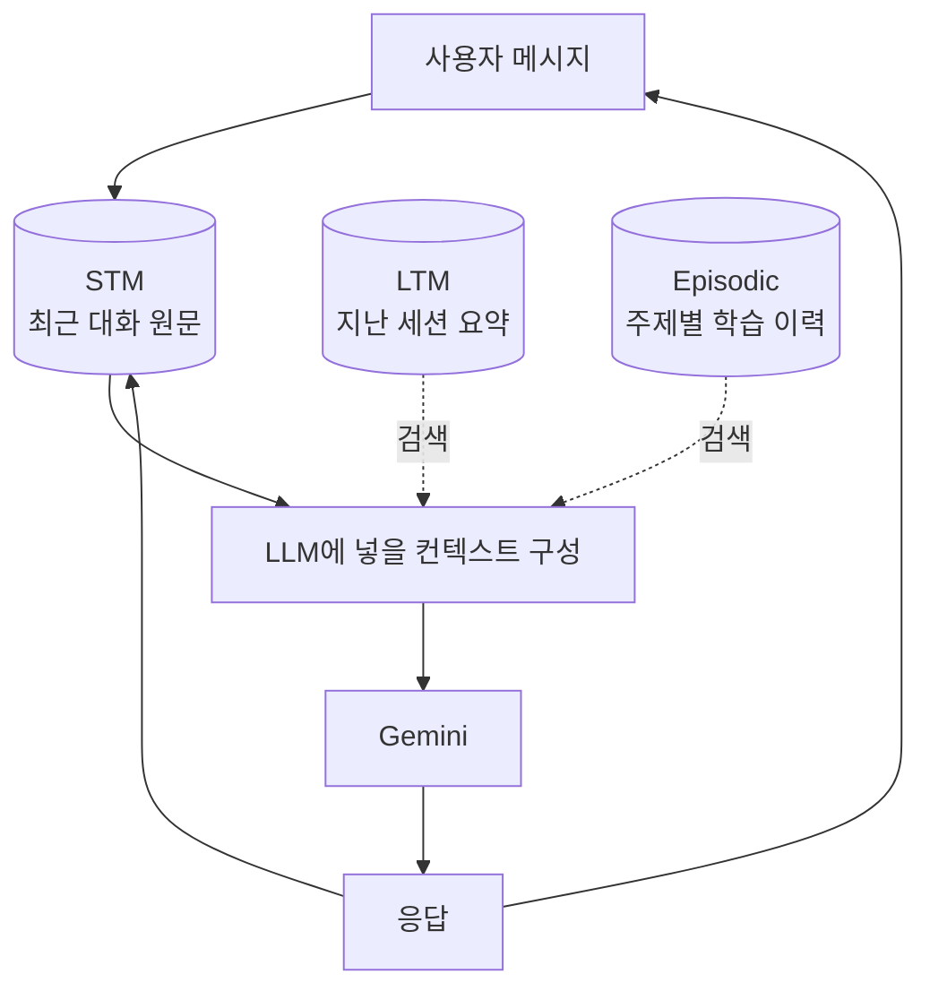
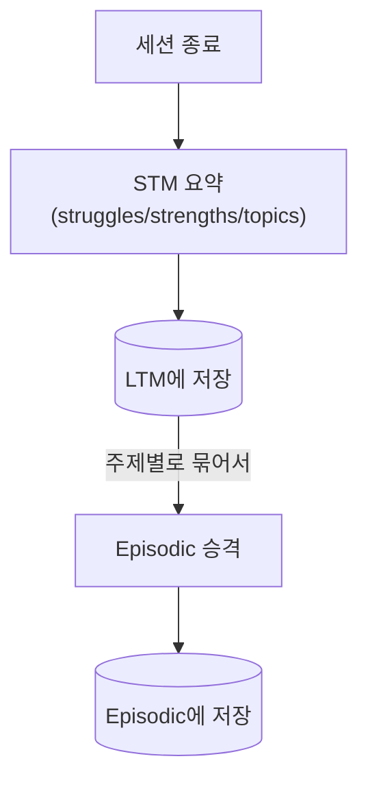

# 아키텍처

> 진행 중인 정리 작업 기준. `[정리 대상]` 표시는 GDG 워크숍 데모 재현을 위해 만들어졌던 코드로, 단계적으로 제거될 예정이다. 자세한 배경은 `[[project-memory-augmented-chatbot-refactor]]` 메모리 참고.

## 디렉토리 구조
```
chatbot.py                    # Chatbot 클래스: 대화 진입점 + 메모리 주입 루프
episodic_schema.py             # Episodic 저장소 스키마 (SQLite + Chroma)
memory/
├── stm.py                     # STM 저장소 (세션 원문 메시지)
├── ltm.py                     # LTM 저장소 (세션 요약, SQLite + Chroma)
├── retrieval.py                # LTM/Episodic 검색 입력 구성과 hybrid 점수 계산
├── session_manager.py           # 세션 시작/종료 이벤트 처리
├── consolidation.py              # 세션 종료 시 STM -> LTM/Episodic 전이 (실제 사용 경로)
├── tagger.py                      # LLM 기반 topic tagging
├── demo_fixture.py                 # [정리 대상] GDG 데모 학습자 픽스처
└── demo_conversion.py                # [정리 대상 일부] 유휴/일 단위 배치 승격 API + 데모 변환 도구
data/
├── chatbot.db                        # SQLite (STM/LTM/Episodic 테이블), gitignore 대상
├── chroma/                            # Chroma 벡터 저장소, gitignore 대상
└── demo_memory_*.json                  # [정리 대상] 데모 픽스처 원본 JSON
scripts/                                # Harness 메타 도구 (챗봇 로직과 무관, 별도 관심사)
notebooks/                              # 원본 GDG 워크숍 핸즈온 노트북
```

## 패턴
- 클래스는 얇게: `Chatbot`은 진입점 역할만 하고, 실제 로직은 `memory/*.py`와 `episodic_schema.py`의 모듈 함수들에 위임한다.
- 저장소는 이중화: 구조화된 필드(요약, 태그, 이력)는 SQLite에, 검색용 벡터는 Chroma에 저장한다.
- Best-effort fallback: LLM 호출(topic tagging, 임베딩 등)이 실패하거나 없을 때는 예외를 던지는 대신 deterministic fallback으로 대체해 대화 흐름이 끊기지 않게 한다. 단, 임베딩 fallback은 현재 서로 다른 3곳에서 호환되지 않는 방식으로 존재하는 문제가 있어 별도 정리가 필요하다 (메모리 참고).

## 데이터 흐름

### ① 대화 중 (매 turn)


### ② 세션 종료 후 (기억 승격)


`consolidate_session()`(`memory/consolidation.py`)이 세션 종료 이벤트에 연결된 실제 경로다. `memory/demo_conversion.py`의 유휴시간(3시간)/매일 03시 배치 승격 함수는 현재 이 실제 경로와 별개로 존재하며, 살아있는 `Chatbot`에서 호출되지 않는다 — 제품에 남길지는 미결정 상태.

## 저장소 구조
Next.js 템플릿의 "상태 관리" 대신, 이 프로젝트는 클라이언트 상태가 없고 영속 저장소만 있으므로 이렇게 대체한다.

**SQLite 테이블**
- `stm_messages`: 세션 원문 메시지
- `ltm`: 세션 단위 요약
- `episodic_memory`: 주제별 누적 학습 이력
- `memory_state`: 세션별 승격 상태/커서 추적

**Chroma 컬렉션**
- `ltm_embeddings`: LTM 요약 임베딩
- `episodic_topics`: 주제 임베딩
