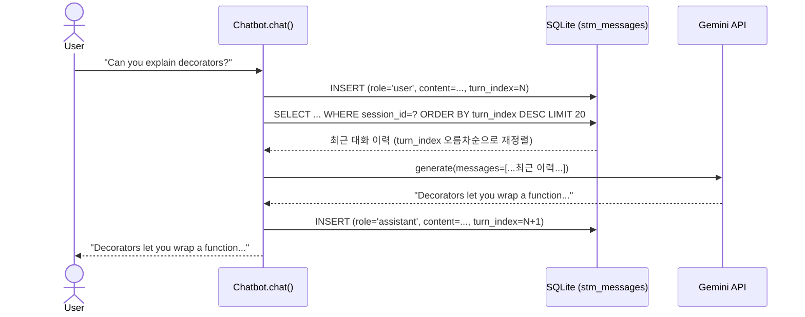
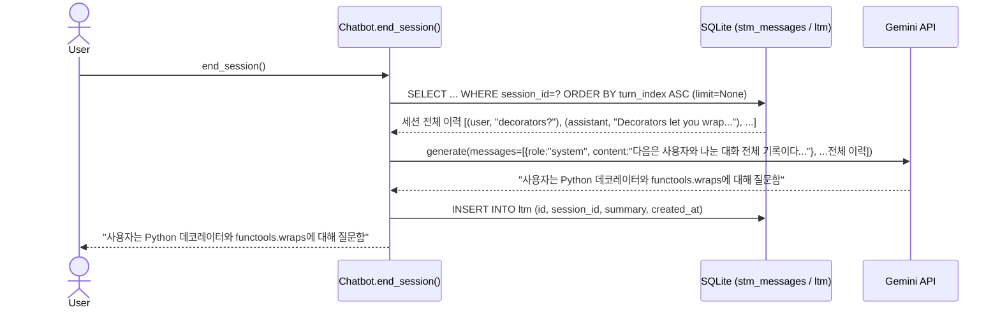

# lossy_clone 데이터 흐름

단계(phase)별 데이터 흐름을 mermaid로 정리합니다. 각 단계는 이전 단계의 흐름 위에 새 단계가 순서대로 끼워지는 방식으로 쌓입니다 (`docs/ADR.md` ADR-003 — 단계적으로 쌓는다). 아직 만들지 않은 단계는 다이어그램 없이 예정으로만 남겨둡니다.

## 1단계 — Chatbot + STM

- **`turn_index`**: `session_id` 내 메시지 저장 순서, 0부터 시작하는 정수. 정렬 기준은 `timestamp`가 아니라 `turn_index` — 정수 비교가 확정적이고, `UNIQUE(session_id, turn_index)`로 DB 레벨에서 중복 순번 방지.
- **왜 매번 최근 이력을 다시 가져오는가**: Gemini API는 stateless, 이전 턴을 기억 안 함. 맥락 유지하려면 매 요청마다 이전 대화를 통째로 다시 전송해야 함. STM이 그 역할, `chat()` 호출마다 최근 N개 재조회 후 LLM에 전달.
- **`get_recent_messages()`에서 정렬을 두 번 하는 이유**: "어떤 메시지를 고를지"와 "고른 걸 어떤 순서로 넘길지"는 별개 문제. SQL은 `turn_index DESC LIMIT N`으로 조회 — 여기서 DESC가 맞음(ASC로 하면 최신 N개가 아니라 가장 오래된 N개가 잡힘). 이렇게 고른 N개를 그대로 LLM에 넘기면 최신 메시지가 맨 앞에 오는, 시간이 거꾸로 가는 대화록이 되어버리므로 파이썬 `reversed()`로 다시 오름차순(대화가 실제 흘러간 순서)으로 뒤집은 뒤 반환. 고르는 기준은 내림차순, LLM에 넘기는 순서는 오름차순 — 둘 다 맞는 동작이고 목적이 다름.
- **Gemini는 메시지 하나가 아니라 대화 전체를 받음**: `chat()`은 현재 사용자 메시지를 STM에 먼저 저장한 뒤 `get_recent_messages()`를 호출 → 과거 턴 + 방금 저장한 현재 메시지까지 전부(최대 `history_limit`, 기본 20) 포함. 이 리스트가 그대로 `generate(messages=...)`에 전달되고, `GeminiLLMClient`가 이를 Gemini `contents` 배열로 변환(메시지당 entry 1개, `assistant`→`model`). 매 요청마다 대화 전체를 통째로 받는 구조.
- **`generate()`는 fetch 함수가 아님**: fetch는 앞 단계 `SELECT`에서 이미 끝났다. `generate(messages=...)`는 앞서 설명한 대화 전체(이력)를 입력으로 받아 다음 응답 텍스트만 생성한다. 순서: `SELECT` → 이력 반환 → `generate(...)`. Gemini REST 엔드포인트 이름(`generateContent`)에 맞춘 네이밍이다.
- **Chroma(벡터 DB)는 1단계에서 안 씀**: `lossy_clone/` 전체에 Chroma 관련 코드가 없고, `lossy_clone/requirements.txt`에도 `requests`만 있다 (저장소 루트의 `requirements.txt`에는 `chromadb`가 있지만, 그건 원본 프로젝트 것이고 `lossy_clone`은 참조하지 않는다). `docs/PRD.md`의 "MVP 제외 사항 (1단계 기준)"에 "Chroma 등 벡터 DB, 임베딩 검색"이 명시적으로 빠져 있고, 1단계는 SQLite 기반 STM만 쓴다. Chroma는 원본 프로젝트(루트의 `episodic_schema.py`, `memory/ltm.py` 등)에서 LTM/Episodic 임베딩 검색용으로 쓰이는 것으로, `lossy_clone`에서는 아직 없는 2~4단계(LTM/Episodic/검색·통합)에서나 등장할 가능성이 있다.

## 2단계 — LTM

- **`end_session()`은 `chat()`과 트리거 시점이 다르다**: `chat()`은 매 턴 호출되지만 `end_session()`은 호출자가 세션을 끝내고 싶을 때 명시적으로 부른다. 원본의 exit-keyword 감지·`max_turns`·`inactivity_timeout` 같은 자동 판단은 없다 — `docs/ADR.md` ADR-006.
- **왜 `limit=None`으로 전체 이력을 다시 읽는가**: `chat()`의 대화 컨텍스트(`history_limit`, 기본 20개)와 요약 대상은 서로 다른 개념이다. 세션이 20턴을 넘으면 `chat()`은 최근 20개만 LLM에 보내지만, `end_session()`은 세션 전체를 요약해야 하므로 별도로 전체 조회가 필요하다.
- **STM 이력이 비어 있으면 아무 것도 하지 않는다**: `history`가 빈 리스트면 LLM을 호출하지 않고 `None`을 반환한다. 빈 대화를 요약시키는 것은 의미가 없고, 불필요한 LLM 호출 비용도 아낀다.
- **요약 지시 메시지(`role="system"`)는 STM에 저장되지 않는다**: `chat()`이 저장하는 실제 대화 기록이 아니라 이번 `generate()` 호출에만 쓰이는 일회성 지시이기 때문에, `add_message()`로 `stm_messages`에 남기지 않는다.
- **LTM엔 `summary` 하나만 담는다**: 원본의 `struggles`/`strengths`/`confusions`/`topic_tags`/`embedding`은 넣지 않는다. 강점/약점/혼란 누적은 3단계(Episodic memory)의 몫이다 — `docs/ADR.md` ADR-005.
- **`end_session()`을 여러 번 호출하면 LTM에 요약이 중복으로 쌓인다**: STM은 지우지 않으므로 다시 호출하면 같은 이력을 또 요약해 새 row를 만든다. 이를 막는 상태 추적은 의도적으로 만들지 않았다 — `docs/ADR.md` ADR-006.

## 3단계 — Episodic memory (예정)

주제별 학습 이력(강점/약점/질문)을 누적하는 흐름이 추가됩니다. 아직 구현되지 않았습니다.

## 4단계 — 검색/통합 (예정)

LTM/Episodic 검색, 반복 질문 감지, 통합 컨텍스트 구성이 추가됩니다. 아직 구현되지 않았습니다.
